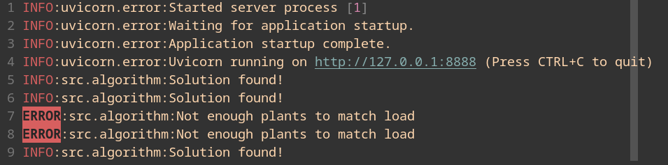

# powerplant-coding-challenge

By [Denis Gontcharov](https://gontcharov.be) for the SPaaS IS team

## Running the project

Build and run the Docker image using [docker-compose](https://docs.docker.com/compose/):

```bash
docker-compose up -d
```

## Testing the REST API

Three tests have been implemented in the `tests/` directory.
They can be run inside the Docker container with:

```bash
docker exec -it challenge pytest -rP
```

A request can also be sent manually using a chosen payload file:

```python
import requests

url = 'http://127.0.0.1:8888/productionplan/'
payload = open('example_payloads/payload1.json', 'rb').read()
response = requests.post(url, data=payload)
print(response.json())
```

The Python environment can be recreated from the `docker/requirements.txt` file.

## API documentation


Go to <http://127.0.0.1:8888/docs>

This page displays automatic interactive API documentation.

## Exception logging

The app logs exceptions in the `algorithm.py` file to the file `log/server.log`.



## Input validation

The REST API validates the JSON string in the request body by comparing all
key names and value types against the [Pydantic model](https://fastapi.tiangolo.com/tutorial/body-nested-models/)
defined in `src/main.py`.

***
